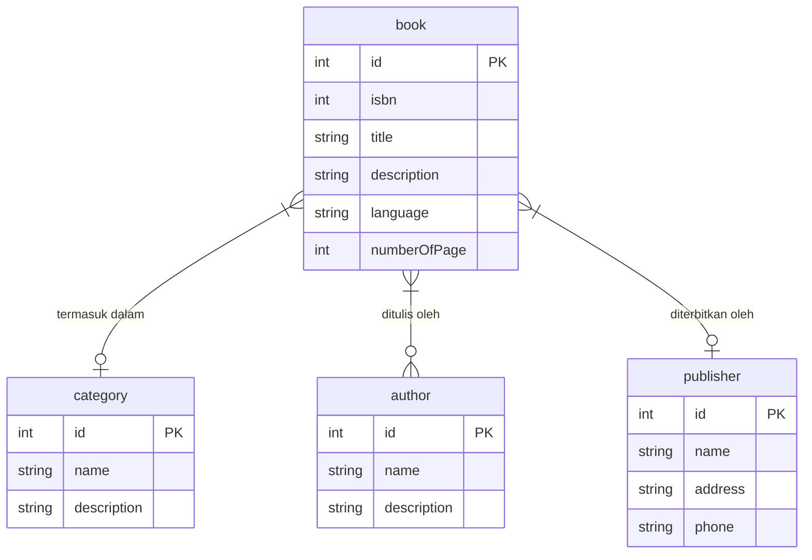

# ERD Katalog Buku

The Book Catalog Application is a system designed to manage and monitor a collection of books in a library. This application allows users to search, add, edit, and delete book data. Other features include statistical reports on books and borrowing. This application aims to facilitate library management and improve the efficiency of resource usage.

## Data Dictionary for `book` Table

| Field Name      | Data Type | Description                                   |
|------------------|-----------|-----------------------------------------------|
| id               | int       | Primary key, unique identifier for each book |
| isbn             | int       | International Standard Book Number           |
| title            | string    | Title of the book                            |
| description      | string    | Brief description of the book                |
| language         | string    | Language in which the book is written        |
| numberOfPage     | int       | Total number of pages in the book            |
| author           | string    | Name of the author of the book               |
| publisher        | string    | Name of the publisher of the book            |

## Data Dictionary for `category` Table

| Field Name      | Data Type | Description                                   |
|------------------|-----------|-----------------------------------------------|
| id               | int       | Primary key, unique identifier for each category |
| name             | string    | Name of the category                         |
| description      | string    | Brief description of the category            |

## Data Dictionary for `author` Table

| Field Name      | Data Type | Description                                   |
|------------------|-----------|-----------------------------------------------|
| id               | int       | Primary key, unique identifier for each author |
| name             | string    | Name of the author                           |
| description      | string    | Brief description of the author              |

## Data Dictionary for `publisher` Table

| Field Name      | Data Type | Description                                   |
|------------------|-----------|-----------------------------------------------|
| id               | int       | Primary key, unique identifier for each publisher |
| name             | string    | Name of the publisher                        |
| address          | string    | Address of the publisher                     |
| phone            | string    | Phone number of the publisher                |

